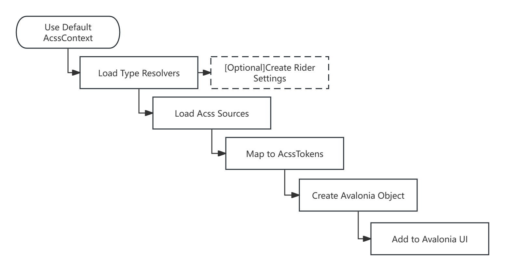

# Processes and concepts

The principle of Acss is relatively simple. Its operation process is shown in the figure below.

<figure><figcaption></figcaption></figure>

## AcssContext

When you use Acss, you need to build an Acss context, which we call AcssContext, and this context is responsible for providing all the services needed during Acss operation, including the syntax analysis service, the syntax interpretation service, the type parsing service, the various factories such as resources, the Acss loading service, the file monitoring service, and the Acss configuration service, Rider configuration service. Most of these services are built in the Acss class library. Some of these services require user participation, such as the type resolution service.&#x20;

At the same time, Acss also provides access to all dynamic resources at runtime, including Acss files, Acss Tokens and so on.

## TypeResolver

TypeResolver is a type resolution service deployed in AcssContext. When building an AcssContext, users need to register the types they want to use with the TypeResolver. When unregistered types appear in Acss code, they will not be parsed and will be skipped, and debugging information will be output, for debugging see [here](tiao-shi.md).

## Acss Source

Acss Source is the definition of Acss code, which is represented in Acss as an interface called ISource. We currently have two built-in code sources, local files (File Source) and embedded sources (EmbeddedSource). Please refer to [Code Sources](../zhu-ti-bang-zhu/ru-he-shi-yong-acss/dai-ma-yuan.md) for details.

## AcssTokens

When you load a code source using the Acss loader, the code source is first read and parsed into memory to form the original model structure, AcssTokens.


Note that Acss supports inheritance and reuse, and AcssTokens are also reusable. AcssTokens will only be loaded once for a particular source.


## Avalonia Object

After AcssTokens are created during the Acss loader loading process, they continue to be parsed into specific Avalonia objects such as Style, Resource, Animation, other Objects, etc. These objects are loaded into the Avalonia UI according to certain rules.
